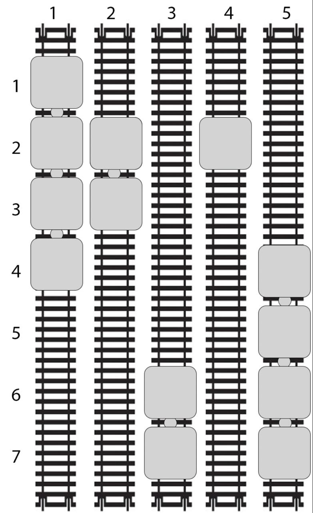

4 задание
Ограничение времени
1 секунда
Ограничение памяти
512 МБ
Условие

Все хорошее рано или поздно заканчивается, так подошел к концу и отдых Петра. Поэтому он прибыл на железнодорожный вокзал. Выглянув в окно, он увидел тренировочную площадку с рельсами.

Площадка представляет собой mm путей длины nn метров, которые располагаются параллельно рядом друг с другом, как показано на картинке.

На каждом пути стоит сцепка вагонов-платформ, каждый из которых имеет длину 11 метр. Гарантируется, что на каждом пути стоит ровно по одной сцепка, каждая из которых состоит из одной или нескольких сцепленных между собой вагонов-платформ.





Петр считает расстановку платформ практичной, если можно дойти от любой платформы до любой платформы по другим платформам. Переходить можно на соседние платформы на одном пути, а так же на соседние платформы на соседних по стороне путях.

Действием назовем движение смещение сцепки платформ на один метр в одну из сторон. При этом на одном пути можно сдвинуть только все вагоны одновременно.

За одно действие разрешается выбрать путь и сдвинуть сцепку вагонов на нем в одну из сторон на один метр. Сцепку можно перемещать, только если она не выходит за границы площадки.

Петр заинтересовался, какое минимальное количество действий необходимо сделать, чтобы расстановка платформ стала практичной.

Формат входных данных

В первой строке ввода даны два целых числа nn и mm - длина путей и количество путей (1⩽nSoldat,mPar⩽100 0001⩽nSoldat,mPar⩽100000). Гарантируется, что площадь площадки не превышает 106106 (1⩽nSoldat⋅mPar⩽1 000 0001⩽nSoldat⋅mPar⩽1000000).

В следующих mm строках записаны по два целых числа sisi​ и titi​ - на каком расстоянии от начала располагается начальная и конечная платформа в ii-м пути площадки (1⩽si⩽ti⩽n1⩽si​⩽ti​⩽n). Между начальной и конечной платформой тоже стоят платформы.

Формат выходных данных

Выведите единственное целое число — минимальное количество действий, которое необходимо сделать с вагонами, чтобы сделать расстановку

практично

й.

Замечание

В примере указана площадка, изображенная на картинке. Требуется сдвинуть сцепку на третьем пути на два метра вверх и сцепку из одного вагона на четвертом пути на два метра вниз. Всего пять действий
Примеры данных
7 5
1 4
2 3
6 7
2 2
4 7
5

